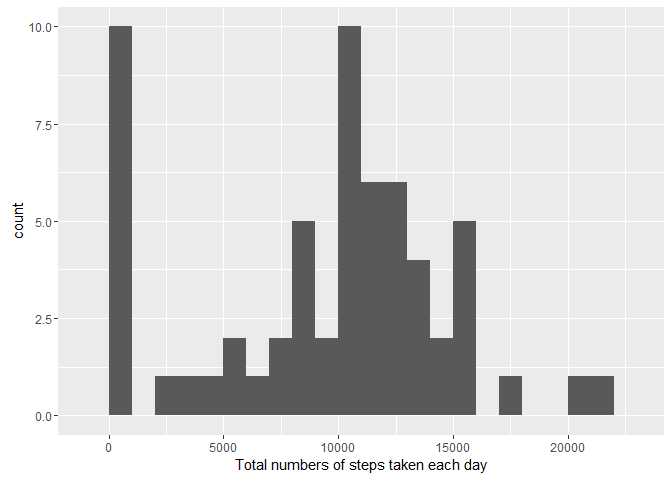
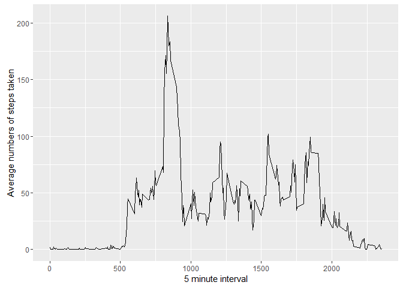
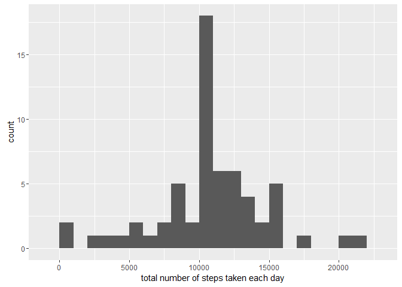
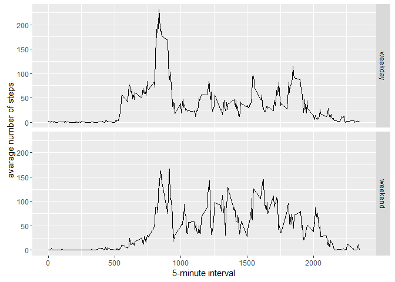

# Reproducible Research: Peer Assessment 1


## Loading and preprocessing the data


## What is mean total number of steps taken per day?


```r
library(ggplot2)
```

```
## Warning: package 'ggplot2' was built under R version 3.2.3
```

```r
stepsbyday <- tapply(activityData$steps, activityData$date, FUN=sum, na.rm=TRUE)
```

#### 1. Make a histogram of the total number of steps taken each day

```r
qplot(stepsbyday, binwidth=1000, xlab="Total numbers of steps taken each day")
```



```r
mean(stepsbyday, na.rm=TRUE)
```

```
## [1] 9354.23
```

```r
median(stepsbyday, na.rm=TRUE)
```

```
## [1] 10395
```

#### 2. Calculate and report the mean and median total number of steps taken per day

```r
mean(stepsbyday, na.rm=TRUE)
```

```
## [1] 9354.23
```

```r
median(stepsbyday, na.rm=TRUE)
```

```
## [1] 10395
```

## What is the average daily activity pattern?


```r
library(ggplot2)

dailyaverage <- aggregate(x=list(steps=activityData$steps),by=list(interval=activityData$interval),FUN=mean, na.rm=TRUE)

ggplot(data=dailyaverage, aes(x=interval, y=steps)) +
  geom_line() +
  xlab("5 minute interval") +
  ylab("Average numbers of steps taken")
```



#### 2. Which 5-minute interval, on average across all the days in the dataset, contains the maximum number of steps?

```r
dailyaverage[which.max(dailyaverage$steps), ]
```

```
##     interval    steps
## 104      835 206.1698
```

## Inputing missing values

##### 1. Calculate and report the total number of missing values in the dataset

```r
missing <- is.na(activityData$steps)
sum(missing)
```

```
## [1] 2304
```

```r
table(missing)
```

```
## missing
## FALSE  TRUE 
## 15264  2304
```

#### 2. Devise a strategy for filling in all of the missing values in the dataset. The strategy does not need to be sophisticated. For example, you could use the mean/median for that day, or the mean for that 5-minute interval, etc.


```r
newActivityData <- activityData
for (i in 1:nrow(newActivityData)) {
  if (is.na(newActivityData$steps[i])) {
    
    newActivityData$steps[i] <- dailyaverage[which(newActivityData$interval[i] == dailyaverage$interval),]$steps
    
  }
  
  
}
```

#### 3. Create a new dataset that is equal to the original dataset but with the missing data filled in.

```r
head(newActivityData)
```

```
##       steps       date interval
## 1 1.7169811 2012-10-01        0
## 2 0.3396226 2012-10-01        5
## 3 0.1320755 2012-10-01       10
## 4 0.1509434 2012-10-01       15
## 5 0.0754717 2012-10-01       20
## 6 2.0943396 2012-10-01       25
```

```r
sum(is.na(newActivityData))
```

```
## [1] 0
```

#### 4. Make a histogram of the total number of steps taken each day and Calculate and report the mean and median total number of steps taken per day.

```r
total.steps <- tapply(newActivityData$steps, newActivityData$date, FUN = sum)
qplot(total.steps, binwidth = 1000, xlab = "total number of steps taken each day")
```



```r
mean(total.steps)
```

```
## [1] 10766.19
```

```r
median(total.steps)
```

```
## [1] 10766.19
```


## Are there differences in activity patterns between weekdays and weekends?

#### 1. Create a new factor variable in the dataset with two levels - "weekday" and "weekend" indicating whether a given date is a weekday or weekend day.

```r
newActivityData$dateType <-  ifelse(as.POSIXlt(newActivityData$date)$wday %in% c(0,6), 'weekend', 'weekday')
```

#### 2. Make a panel plot containing a time series plot (i.e. type = "l") of the 5-minute interval (x-axis) and the average number of steps taken, averaged across all weekday days or weekend days (y-axis). 

```r
averagednewActivityData <- aggregate(steps ~ interval + dateType, data=newActivityData, mean)
ggplot(averagednewActivityData, aes(interval, steps)) + 
    geom_line() + 
    facet_grid(dateType ~ .) +
    xlab("5-minute interval") + 
    ylab("avarage number of steps")
```


